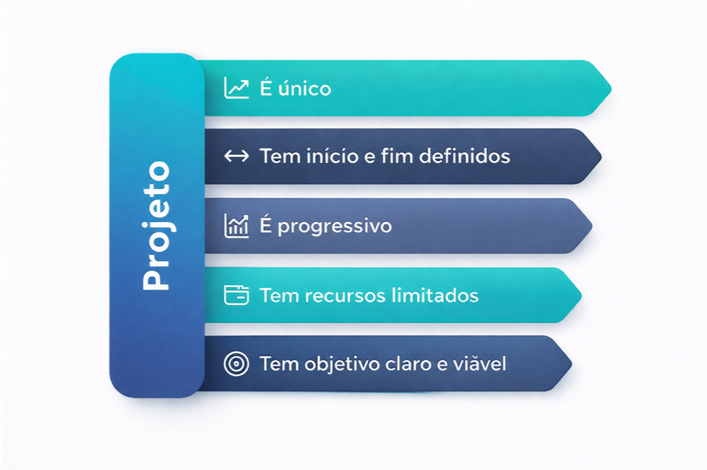
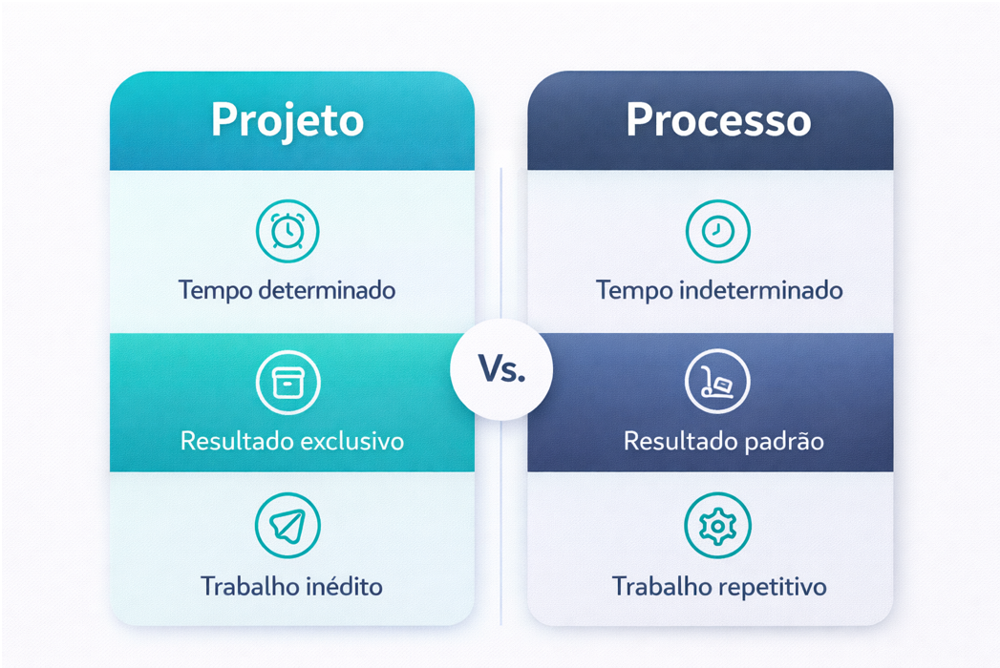
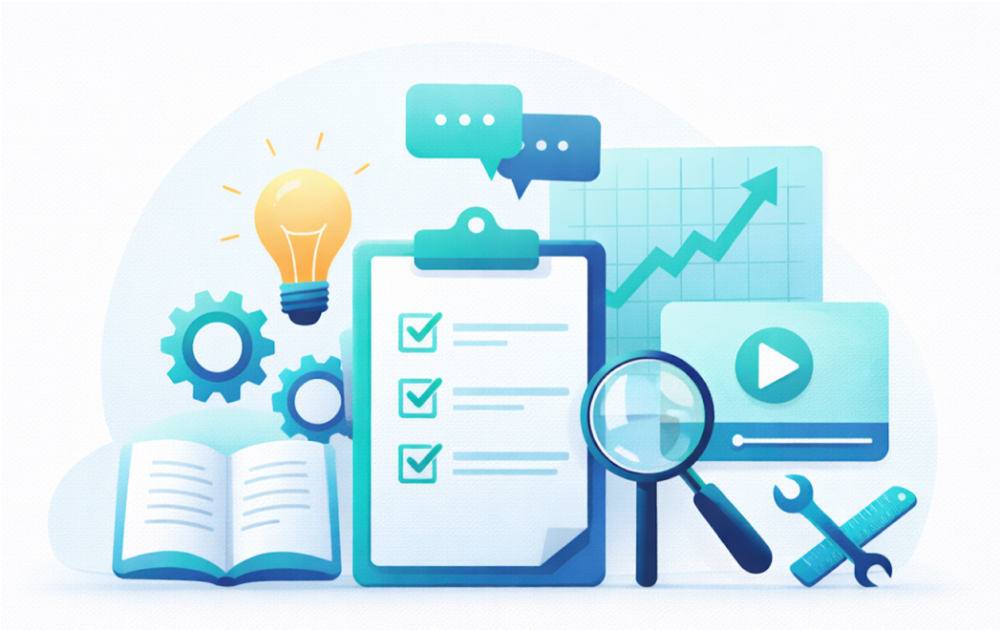
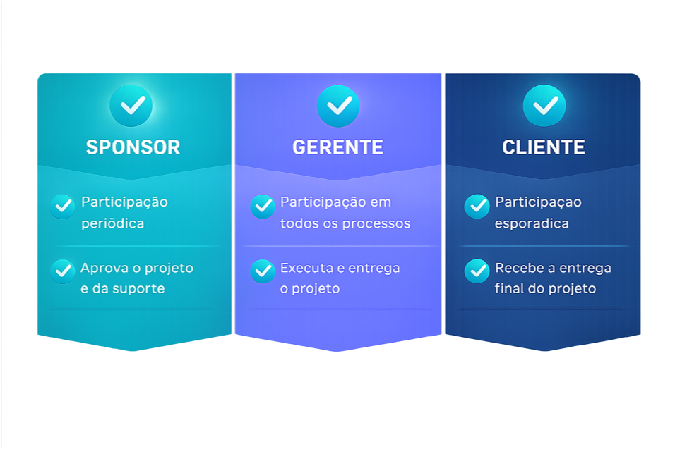
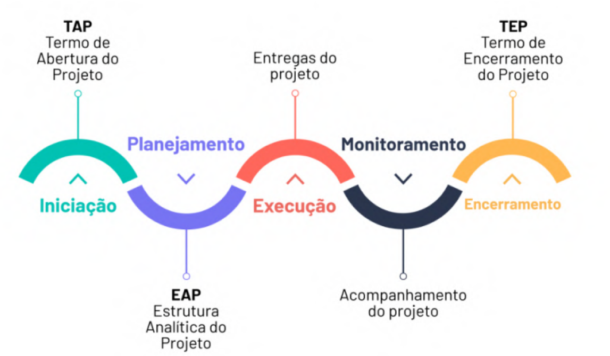
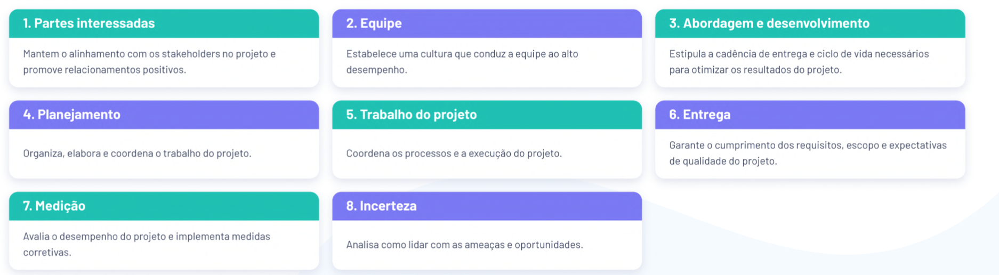

# Aula 01 — Introdução ao Gerenciamento de Projetos

## O que é um projeto?

De acordo com o PMI, projeto é um:

> **“Esforço temporário empreendido para criar um produto, serviço ou resultado exclusivo.”**

Isso significa que um projeto:

- tem **início e fim definidos**;
- é criado para gerar **algo único**;
- possui **objetivo claro**;
- utiliza **recursos limitados**;
- evolui de forma **progressiva**, à medida que é planejado e executado.

---

## Projeto vs. Processo

Embora os termos sejam parecidos, **projeto** e **processo** não significam a mesma coisa.

Um **projeto** é temporário e busca gerar um resultado exclusivo. Já um **processo** é contínuo, repetitivo e voltado à produção padronizada de resultados. Em outras palavras, o projeto tem caráter único, enquanto o processo faz parte da rotina de funcionamento de uma organização.

A imagem a seguir ajuda a visualizar essa diferença: o projeto possui tempo determinado, resultado exclusivo e trabalho inédito; o processo, por sua vez, possui tempo indeterminado, resultado padrão e trabalho repetitivo.

---

## O que é o gerenciamento de projetos?

O **gerenciamento de projetos** é o:

> **Conjunto de metodologias, ferramentas e conhecimentos empreendidos para garantir o sucesso dos projetos.**

Ele envolve planejar, organizar, acompanhar e controlar as atividades necessárias para que o projeto alcance seus objetivos com qualidade, dentro do prazo e do orçamento definidos.

---

## Qual a importância do gerenciamento de projetos para as empresas?

O gerenciamento de projetos é importante porque contribui diretamente para o sucesso das iniciativas desenvolvidas pelas organizações. Entre seus principais benefícios, destacam-se:

- garantir o sucesso do projeto;
- manter o projeto dentro do prazo e do orçamento disponíveis;
- organizar as atividades para que o cronograma seja seguido;
- garantir os recursos necessários para cumprir os requisitos de qualidade;
- alinhar a execução aos objetivos do projeto;
- desenvolver estratégias para otimizar a execução.

Em um cenário empresarial, isso significa reduzir falhas, melhorar a utilização dos recursos e aumentar as chances de entregar resultados consistentes e valiosos.

---

## Como funciona o gerenciamento de projetos?

O gerenciamento de projetos pode ser compreendido a partir de **três elementos fundamentais**:

- **Papéis do projeto**;
- **Ciclo de vida do projeto**;
- **Áreas de gerenciamento**.

Cada um desses elementos contribui para a organização e para o controle do trabalho realizado ao longo do projeto.

---

## Papéis do gerenciamento de projetos

Em um projeto, diferentes participantes assumem responsabilidades específicas. De forma geral, o **sponsor** apoia institucionalmente o projeto, aprova decisões importantes e oferece suporte. O **gerente de projetos** acompanha todas as etapas, coordena a equipe e garante que o trabalho seja executado e entregue. Já o **cliente** participa de forma mais pontual, validando as entregas e recebendo o resultado final.

A compreensão desses papéis é essencial, pois ajuda os alunos a perceberem que um projeto depende de responsabilidades bem definidas para funcionar adequadamente.

---

## Ciclo de vida do projeto

O ciclo de vida do projeto representa as etapas pelas quais ele passa desde sua criação até seu encerramento. Em geral, esse ciclo envolve:

- **Iniciação**;
- **Planejamento**;
- **Execução**;
- **Monitoramento**;
- **Encerramento**.

O **TAP (Termo de Abertura do Projeto)** marca formalmente o início do projeto. Em seguida, o planejamento organiza o trabalho, definindo como ele será executado. Durante a execução, as entregas são produzidas, enquanto o monitoramento acompanha o desempenho e corrige desvios. Por fim, o projeto é concluído com o **TEP (Termo de Encerramento do Projeto)**.

A imagem a seguir ilustra esse fluxo de forma visual e integrada.

---

## Áreas de gerenciamento de projetos

O gerenciamento de projetos envolve diferentes áreas que orientam o trabalho do gerente e da equipe ao longo da execução. Essas áreas ajudam a estruturar o projeto e a garantir que todos os aspectos relevantes sejam considerados.

Na imagem a seguir, aparecem oito áreas importantes:

1. **Partes interessadas** — mantém o alinhamento com stakeholders e promove relacionamentos positivos;
2. **Equipe** — estabelece uma cultura voltada ao alto desempenho;
3. **Abordagem e desenvolvimento** — define a cadência de entrega e o ciclo de vida do projeto;
4. **Planejamento** — organiza e coordena o trabalho do projeto;
5. **Trabalho do projeto** — acompanha os processos e a execução;
6. **Entrega** — garante o cumprimento dos requisitos, escopo e qualidade esperada;
7. **Medição** — avalia o desempenho e apoia ações corretivas;
8. **Incerteza** — analisa ameaças e oportunidades, permitindo melhor tomada de decisão.

Essas áreas mostram que gerenciar projetos vai muito além de apenas acompanhar tarefas: envolve pessoas, comunicação, planejamento, execução, controle e adaptação.

---