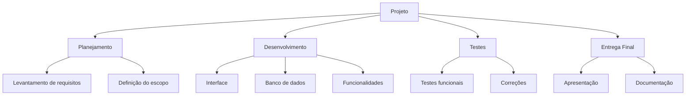

# Aula 04 — Estruturando o Projeto: Estrutura Analítica do Projeto (EAP)


## O que é a Estrutura Analítica do Projeto (EAP)?

A **Estrutura Analítica do Projeto (EAP)** é uma representação organizada do trabalho que precisa ser realizado para que o projeto alcance seus objetivos.

Ela apresenta o projeto de forma hierárquica, partindo de uma visão mais geral até chegar a partes menores, chamadas de **entregáveis** ou **pacotes de trabalho**.

Em outras palavras, a EAP ajuda a responder à seguinte pergunta:

> **O que precisa ser entregue para que o projeto seja considerado concluído?**

A EAP não é uma lista aleatória de tarefas. Ela é uma forma estruturada de organizar o escopo do projeto, facilitando o planejamento, a divisão de responsabilidades, a estimativa de prazos, custos e recursos.

---

## Por que a EAP é importante?

A EAP é importante porque permite visualizar o projeto de maneira mais clara e organizada. Quando o projeto é dividido em partes menores, torna-se mais fácil compreender o que deve ser feito, quem será responsável por cada entrega e quais recursos serão necessários.

Entre os principais benefícios da EAP, destacam-se:

- melhora a compreensão do escopo do projeto;
- ajuda a evitar esquecimentos de entregas importantes;
- reduz a duplicidade de esforços;
- facilita a divisão do trabalho entre os membros da equipe;
- auxilia na criação do cronograma;
- contribui para a estimativa de custos e recursos;
- apoia o acompanhamento e o controle do projeto.

Sem uma EAP bem definida, o projeto pode apresentar falhas de planejamento, retrabalho, atrasos e problemas de comunicação entre os envolvidos.

---

## Relação entre escopo do projeto e EAP

A construção da EAP deve estar baseada no **escopo do projeto**. O escopo define aquilo que será entregue, enquanto a EAP organiza essas entregas em uma estrutura hierárquica.

Assim, antes de construir a EAP, é necessário que o projeto possua uma definição clara de seus objetivos, entregas principais, restrições e expectativas das partes interessadas.

A EAP deve ser construída com base:

- no conteúdo do escopo do projeto;
- nas entregas esperadas;
- nas necessidades do cliente ou da organização;
- nos recursos disponíveis;
- nas informações iniciais levantadas no planejamento.

Portanto, a EAP transforma o escopo em uma estrutura visual e organizada, servindo como base para as próximas etapas do gerenciamento do projeto.

---

## Como a EAP é organizada?

A EAP é construída em formato hierárquico, geralmente de cima para baixo. Isso significa que ela começa com o projeto como um todo e, em seguida, é dividida em partes principais. Cada parte principal pode ser novamente dividida em componentes menores.

A estruturação normalmente ocorre:

- **de cima para baixo**, partindo da visão geral para a visão específica;
- **da esquerda para a direita**, organizando os entregáveis de forma lógica;
- com foco nos **entregáveis**, e não apenas nas atividades;
- considerando todos os itens importantes do projeto.

Um exemplo simples de organização pode ser representado da seguinte forma:



---

## Níveis da EAP

A EAP é formada por diferentes níveis. Cada nível representa um grau de detalhamento do projeto.

### 1. Primeiro nível da EAP

O primeiro nível representa o projeto como um todo. Ele normalmente contém o nome do projeto ou a entrega principal.

Exemplo:

```text
1. Projeto: Desenvolvimento de Aplicativo Escolar
```

Esse nível apresenta a visão mais ampla do projeto.

---

### 2. Segundo nível da EAP

O segundo nível apresenta as partes principais do projeto. Essas partes são grandes entregáveis ou blocos de trabalho que compõem o projeto.

Exemplo:

```text
1. Projeto: Desenvolvimento de Aplicativo Escolar
   1.1 Planejamento
   1.2 Design da interface
   1.3 Desenvolvimento do sistema
   1.4 Testes
   1.5 Implantação
```

Nesse nível, o projeto começa a ser dividido em grandes áreas de entrega.

---

### 3. Terceiro nível da EAP

O terceiro nível detalha cada parte principal em componentes menores. Esses componentes ajudam a compreender melhor o que precisa ser produzido em cada etapa.

Exemplo:

```text
1. Projeto: Desenvolvimento de Aplicativo Escolar
   1.1 Planejamento
       1.1.1 Levantamento de requisitos
       1.1.2 Definição do escopo
       1.1.3 Termo de abertura do projeto

   1.2 Design da interface
       1.2.1 Protótipo das telas
       1.2.2 Definição de cores e fontes
       1.2.3 Validação com o cliente

   1.3 Desenvolvimento do sistema
       1.3.1 Cadastro de usuários
       1.3.2 Consulta de notas
       1.3.3 Consulta de faltas
       1.3.4 Mural de avisos

   1.4 Testes
       1.4.1 Testes das funcionalidades
       1.4.2 Correção de erros
       1.4.3 Validação final

   1.5 Implantação
       1.5.1 Publicação do sistema
       1.5.2 Treinamento dos usuários
       1.5.3 Entrega da documentação
```

Quanto maior o nível de detalhamento, mais fácil se torna planejar prazos, custos, recursos e responsabilidades.

---

## Pontos importantes na elaboração da EAP

Ao elaborar uma EAP, alguns cuidados devem ser observados para que ela realmente ajude no gerenciamento do projeto.

### 1. Cada elemento deve representar um entregável

Cada item da EAP deve representar algo que será produzido ou entregue ao longo do projeto. Esse entregável pode ser tangível ou não.

Exemplos de entregáveis tangíveis:

- protótipo de tela;
- relatório;
- módulo de software;
- documentação final.

Exemplos de entregáveis não tangíveis:

- treinamento realizado;
- validação com o cliente;
- homologação do sistema.

---

### 2. Cada elemento deve representar o somatório dos seus subordinados

Um item superior da EAP deve corresponder ao conjunto dos itens que estão abaixo dele.

Por exemplo, se o item **1.4 Testes** possui os subitens **testes funcionais**, **correção de erros** e **validação final**, então o conjunto desses subitens deve representar todo o trabalho necessário para concluir a etapa de testes.

---

### 3. Cada subordinado pertence a apenas um elemento

Cada item da EAP deve estar vinculado a apenas um elemento superior. Isso evita confusão, duplicidade de responsabilidades e repetição de trabalho.

Por exemplo, o item **protótipo das telas** não deve aparecer ao mesmo tempo dentro de **design da interface** e de **desenvolvimento do sistema**, a menos que existam entregas diferentes claramente definidas.

---

### 4. Os entregáveis devem ser bem definidos

Os entregáveis precisam ser descritos de forma clara, para que todos entendam o que deve ser produzido.

Um item como:

```text
1.3 Fazer sistema
```

é muito genérico.

Uma forma melhor seria:

```text
1.3 Desenvolvimento do sistema
   1.3.1 Cadastro de usuários
   1.3.2 Login e autenticação
   1.3.3 Tela de consulta de informações
```

Quanto mais clara for a descrição, menor será a chance de interpretações diferentes entre equipe, professor, cliente ou patrocinador.

---

### 5. Todos os itens importantes devem estar computados

A EAP deve contemplar todos os entregáveis relevantes do projeto. Se uma entrega importante ficar fora da EAP, ela pode não ser considerada no cronograma, no orçamento ou na divisão de responsabilidades.

Por isso, a equipe deve revisar a EAP e verificar se nada essencial foi esquecido.

---

### 6. A EAP não precisa ser homogênea

Nem todas as partes da EAP precisam ter o mesmo número de níveis ou o mesmo grau de detalhamento.

Algumas partes do projeto podem exigir maior decomposição, enquanto outras podem ser mais simples.

Por exemplo, em um projeto de software, a etapa de desenvolvimento pode ter vários subitens, enquanto a etapa de apresentação final pode ter poucos elementos.

---

### 7. A nomenclatura deve seguir o padrão da organização

Os elementos da EAP devem utilizar uma nomenclatura clara e compatível com o contexto da organização, da disciplina ou do projeto.

Isso ajuda a padronizar a comunicação e facilita o entendimento por todos os envolvidos.

---

## Passo a passo para construir uma EAP

A construção da EAP pode ser feita seguindo três passos principais.

### Passo 1 — Identificar o título do projeto

O primeiro passo é definir o nome do projeto. Esse título deve representar claramente o objetivo principal do trabalho.

Exemplo:

```text
Sistema de Controle de Estoque para Cantina Escolar
```

---

### Passo 2 — Identificar as partes principais do projeto

Depois de definir o título, a equipe deve identificar os grandes blocos de entrega do projeto.

Exemplo:

```text
1. Sistema de Controle de Estoque para Cantina Escolar
   1.1 Planejamento
   1.2 Prototipação
   1.3 Desenvolvimento
   1.4 Testes
   1.5 Implantação
   1.6 Documentação
```

---

### Passo 3 — Dividir cada parte em componentes menores

Em seguida, cada parte principal deve ser dividida em componentes menores, sempre partindo da visão geral para a específica.

Exemplo:

```text
1. Sistema de Controle de Estoque para Cantina Escolar
   1.1 Planejamento
       1.1.1 Definição do problema
       1.1.2 Levantamento de requisitos
       1.1.3 Definição do escopo
       1.1.4 Termo de abertura do projeto

   1.2 Prototipação
       1.2.1 Protótipo da tela de login
       1.2.2 Protótipo do cadastro de produtos
       1.2.3 Protótipo da tela de movimentação de estoque
       1.2.4 Validação do protótipo

   1.3 Desenvolvimento
       1.3.1 Cadastro de produtos
       1.3.2 Cadastro de fornecedores
       1.3.3 Registro de entradas de estoque
       1.3.4 Registro de saídas de estoque
       1.3.5 Relatório de produtos com baixo estoque

   1.4 Testes
       1.4.1 Teste de cadastro de produtos
       1.4.2 Teste de entrada de estoque
       1.4.3 Teste de saída de estoque
       1.4.4 Correção de falhas

   1.5 Implantação
       1.5.1 Configuração do ambiente
       1.5.2 Publicação da aplicação
       1.5.3 Treinamento do usuário

   1.6 Documentação
       1.6.1 Manual do usuário
       1.6.2 Relatório técnico
       1.6.3 Apresentação final
```

---

## Diferença entre EAP e cronograma

É comum confundir EAP com cronograma, mas eles possuem finalidades diferentes.

A **EAP** mostra **o que será entregue** no projeto. Já o **cronograma** mostra **quando as atividades serão realizadas**.

| Elemento | Pergunta principal | Exemplo |
|---|---|---|
| EAP | O que será entregue? | Protótipo da tela de login |
| Cronograma | Quando será feito? | De 10/05 a 15/05 |

Portanto, a EAP deve ser construída antes do cronograma, pois ela ajuda a identificar quais entregas precisam ser planejadas no tempo.

---

## Exemplo para discussão

Uma equipe de alunos foi responsável por desenvolver um sistema simples para controle de empréstimos de livros em uma biblioteca escolar.

Inicialmente, a equipe definiu apenas que iria “fazer um sistema de biblioteca”. No entanto, durante o desenvolvimento, surgiram dúvidas sobre quais funcionalidades deveriam ser entregues, quem seria responsável por cada parte e quais documentos deveriam ser produzidos.

Após uma reunião de planejamento, a equipe decidiu criar uma EAP com os seguintes entregáveis:

```text
1. Sistema de Biblioteca Escolar
   1.1 Planejamento
   1.2 Cadastro de livros
   1.3 Cadastro de usuários
   1.4 Controle de empréstimos
   1.5 Testes
   1.6 Documentação
   1.7 Apresentação final
```

Com essa estrutura, a equipe conseguiu visualizar melhor o projeto, dividir responsabilidades e organizar o trabalho.

### Questões para análise

- A definição inicial “fazer um sistema de biblioteca” era suficiente para planejar o projeto?
- Como a EAP ajudou a equipe a compreender melhor o escopo?
- Quais entregáveis poderiam ser detalhados em um terceiro nível?
- O que poderia acontecer se a equipe não elaborasse uma EAP?

---

## Atividade prática em sala

Em grupos, os alunos deverão construir uma EAP para um projeto escolhido pela equipe.

### Orientações

1. Definir o título do projeto.
2. Identificar as partes principais do projeto.
3. Dividir cada parte em componentes menores.
4. Verificar se todos os entregáveis importantes foram contemplados.
5. Organizar a EAP em formato hierárquico.
6. Apresentar a estrutura para a turma.

### Sugestões de projetos

- Aplicativo de controle financeiro pessoal;
- Sistema de reserva de salas;
- Site institucional para uma empresa;
- Sistema de biblioteca escolar;
- Aplicativo de lista de tarefas;
- Sistema para controle de estoque;
- Aplicativo de acompanhamento de estudos.

### Modelo para preenchimento

```text
1. Nome do Projeto
   1.1 Parte principal 1
       1.1.1 Entregável
       1.1.2 Entregável

   1.2 Parte principal 2
       1.2.1 Entregável
       1.2.2 Entregável

   1.3 Parte principal 3
       1.3.1 Entregável
       1.3.2 Entregável
```

---

## Questões para discussão

1. Qual é a principal função da EAP em um projeto?
2. Por que a EAP deve ser construída com base no escopo do projeto?
3. Qual é a diferença entre uma entrega e uma atividade?
4. Por que cada elemento subordinado deve pertencer a apenas um elemento superior?
5. Como a EAP pode ajudar na criação do cronograma?
6. O que pode acontecer quando entregáveis importantes não aparecem na EAP?
7. A EAP precisa ter o mesmo número de níveis em todas as partes do projeto? Justifique.
8. Em um projeto de software, quais entregáveis não podem ser esquecidos?

---

## Síntese da aula

A **Estrutura Analítica do Projeto (EAP)** é uma ferramenta essencial para organizar o trabalho do projeto. Ela permite decompor o projeto em entregáveis menores, facilitando o planejamento, a comunicação, a divisão de responsabilidades e o controle da execução.

Uma boa EAP deve ser clara, completa, organizada de forma hierárquica e baseada no escopo do projeto. Dessa forma, ela contribui diretamente para aumentar as chances de sucesso do projeto.

---

## Referências

CIERCO, Agliberto Alves. *Gestão de projetos*. Rio de Janeiro: Editora FGV, 2015.

PMI. *Um guia do conhecimento em gerenciamento de projetos (Guia PMBOK)*. 6. ed. EUA: Project Management Institute, 2017.

---
