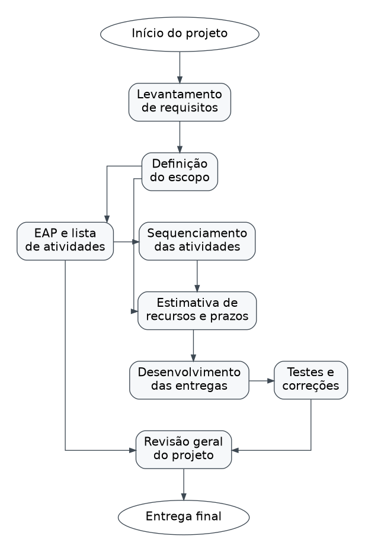
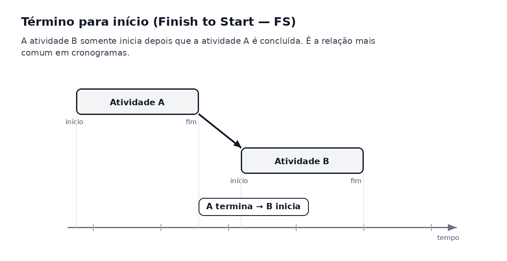
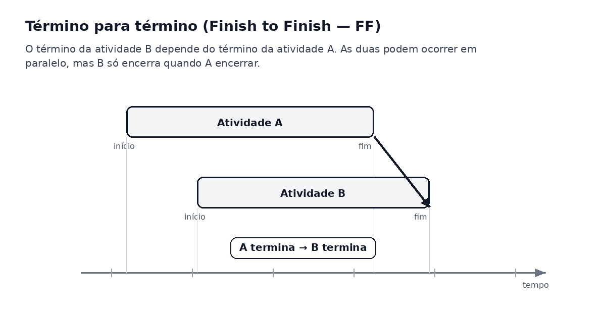
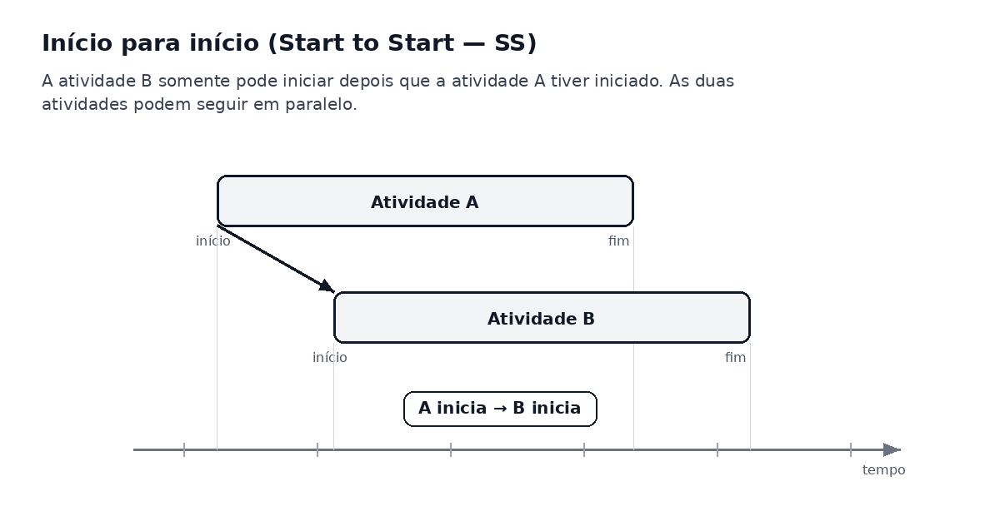
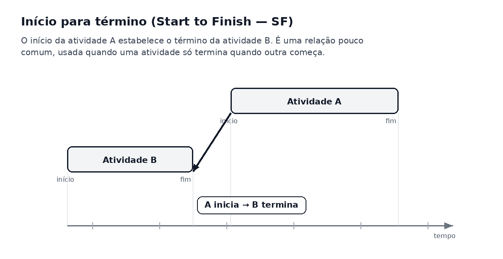

# Aula 05 — Estruturando o Projeto: Lista, Sequenciamento e Estimativas de Atividades

Na aula anterior, estudamos a **Estrutura Analítica do Projeto (EAP)** e vimos que ela organiza o projeto em entregáveis, facilitando a compreensão do escopo e a divisão do trabalho.

Nesta aula, daremos continuidade ao planejamento do projeto. Depois de construir a EAP, o próximo passo é transformar os entregáveis em uma **lista de atividades**, organizar essas atividades em uma **sequência lógica** e compreender como essa organização contribui para a criação do **cronograma**, para a estimativa de **recursos**, **prazos** e **custos**.

---

## Da EAP para a lista de atividades

A EAP mostra **o que será entregue** no projeto. Porém, para que essas entregas sejam realizadas, é necessário identificar quais atividades precisam ser executadas.

Em outras palavras:

> A EAP apresenta os entregáveis do projeto, enquanto a lista de atividades detalha o trabalho necessário para produzir esses entregáveis.

Por exemplo, se na EAP existe o entregável **protótipo das telas**, a lista de atividades pode incluir:

```text
- Levantar telas necessárias;
- Definir padrão visual;
- Criar protótipo da tela de login;
- Criar protótipo da tela principal;
- Validar protótipo com o cliente ou professor.
```

A lista de atividades ajuda a transformar a estrutura do projeto em ações que poderão ser planejadas, sequenciadas, acompanhadas e controladas.


---

## Cuidados ao elaborar a lista de atividades

Ao elaborar a lista de atividades, alguns cuidados são importantes para evitar problemas no planejamento.

### 1. A EAP não deve incluir atividades condicionais

A EAP não deve ser construída com base em possibilidades incertas, como:

```text
1.4.2 Corrigir erro, caso aconteça
1.4.3 Refazer tela, se o cliente não gostar
```

Esse tipo de item é condicional e pode gerar confusão. A EAP deve apresentar entregáveis claros e previstos no escopo do projeto.

No entanto, isso não significa que o planejamento deve ignorar possíveis revisões ou ajustes. O ideal é prever momentos adequados de revisão dentro do projeto.

---

### 2. As revisões devem ser planejadas em pontos-chave

Em muitos projetos, especialmente em projetos de software, é comum que ocorram revisões ao longo do desenvolvimento.

Essas revisões podem aparecer em momentos importantes, como:

- após o levantamento de requisitos;
- após a construção do protótipo;
- após o desenvolvimento das funcionalidades;
- antes da entrega final.

Quando houver muitas revisões, o mais adequado é criar uma atividade de **revisão geral do projeto**, em vez de espalhar várias revisões pequenas e repetitivas pela EAP.

Exemplo:

```text
1.6 Revisão geral do projeto
    1.6.1 Verificação dos requisitos
    1.6.2 Conferência das funcionalidades
    1.6.3 Ajustes finais
```

---

## Por que o nível de detalhes é importante?

O nível de detalhes da lista de atividades influencia diretamente a qualidade do planejamento.

Uma lista muito genérica dificulta o acompanhamento do projeto. Já uma lista bem estruturada permite compreender melhor o trabalho necessário para concluir cada entrega.

O nível adequado de detalhes permite:

- desenvolver um cronograma mais realista;
- acompanhar o progresso do projeto;
- verificar se as tarefas estão sendo finalizadas;
- identificar atrasos com mais facilidade;
- estimar melhor recursos, prazos e custos.

### Exemplo de lista pouco detalhada

```text
1. Fazer sistema
2. Testar sistema
3. Entregar sistema
```

Essa lista é muito genérica. Ela não mostra claramente o que precisa ser feito.

### Exemplo de lista mais adequada

```text
1. Levantar requisitos
2. Criar protótipo das telas
3. Desenvolver cadastro de usuários
4. Desenvolver controle de login
5. Desenvolver relatório principal
6. Realizar testes funcionais
7. Corrigir falhas encontradas
8. Revisar documentação
9. Entregar versão final
```

Com mais detalhes, fica mais fácil distribuir responsabilidades, acompanhar o andamento e montar um cronograma.

---

## Resultado da lista de atividades

Ao final dessa etapa, o projeto deve possuir um conjunto de atividades bem estruturado.

Esse conjunto deve conter todas as atividades previstas para o projeto e deve estar relacionado aos entregáveis definidos na EAP.

A lista de atividades pode conter apenas as descrições das atividades ou também outros identificadores importantes, como:

- código da atividade;
- descrição da atividade;
- atividade predecessora;
- atividade sucessora;
- recursos necessários;
- prazo estimado;
- responsável pela execução.

### Exemplo de estrutura de lista de atividades

| Código | Atividade | Predecessora | Sucessora | Recurso necessário | Prazo estimado |
|---|---|---|---|---|---|
| A1 | Levantar requisitos | — | A2 | Equipe e cliente | 2 dias |
| A2 | Definir escopo | A1 | A3 | Equipe do projeto | 1 dia |
| A3 | Criar protótipo | A2 | A4 | Ferramenta de prototipação | 3 dias |
| A4 | Desenvolver funcionalidades | A3 | A5 | Computadores e IDE | 6 dias |
| A5 | Realizar testes | A4 | A6 | Plano de testes | 2 dias |
| A6 | Corrigir falhas | A5 | A7 | Equipe de desenvolvimento | 2 dias |
| A7 | Entregar projeto final | A6 | — | Documentação e apresentação | 1 dia |

---

## Sequenciamento de atividades

Depois que as atividades são identificadas, é necessário organizá-las em uma sequência lógica.

O sequenciamento permite responder perguntas como:

- Qual atividade deve ser feita primeiro?
- Quais atividades dependem de outras?
- Quais atividades podem ocorrer ao mesmo tempo?
- Qual atividade só pode começar após a conclusão de outra?
- Qual é o caminho necessário até a entrega final do projeto?

Após a definição das atividades e de suas predecessoras, torna-se possível calcular o tempo necessário para o projeto e elaborar um **diagrama de rede**.

---

## Diagrama de rede

O **diagrama de rede** mostra a sequência lógica das atividades de um projeto. Ele permite visualizar as dependências entre as atividades e compreender como o trabalho deve avançar.

No diagrama, cada atividade aparece conectada a outras atividades, indicando a ordem em que elas devem acontecer.



No exemplo acima, algumas atividades dependem diretamente de outras. O desenvolvimento das entregas, por exemplo, só faz sentido depois que as atividades foram organizadas e estimadas.

O diagrama de rede auxilia no cálculo do prazo de conclusão do projeto e também permite acompanhar e controlar melhor sua execução.

---

## Método do Diagrama de Precedência (MDP)

O **Método do Diagrama de Precedência (MDP)** é uma técnica utilizada para identificar e representar o sequenciamento das atividades.

Nesse método:

- as atividades são representadas por retângulos;
- as setas indicam as relações de dependência;
- cada atividade pode ter uma ou mais predecessoras;
- cada atividade pode ter uma ou mais sucessoras.

Uma atividade **predecessora** é aquela que vem antes de outra.  
Uma atividade **sucessora** é aquela que depende de outra para iniciar ou terminar.

Exemplo:

```text
A1 Levantar requisitos → A2 Definir escopo → A3 Criar protótipo
```

Nesse caso:

- **A1** é predecessora de **A2**;
- **A2** é sucessora de **A1**;
- **A2** também é predecessora de **A3**.

---

## Tipos de dependência entre atividades

A identificação das dependências pode ser baseada em três tipos principais:

### 1. Dependências obrigatórias

São dependências que precisam acontecer por causa da natureza do trabalho.

Exemplo:

```text
Não é possível testar uma funcionalidade antes que ela seja desenvolvida.
```

Nesse caso, o desenvolvimento da funcionalidade deve acontecer antes do teste.

---

### 2. Dependências arbitradas

São dependências definidas pela equipe, pelo professor, pelo gerente do projeto ou pela organização, mesmo quando existiriam outras formas possíveis de executar o trabalho.

Exemplo:

```text
A equipe decide validar o protótipo antes de iniciar qualquer implementação.
```

Essa decisão organiza melhor o projeto, mesmo que tecnicamente algumas partes pudessem ser desenvolvidas antes.

---

### 3. Dependências externas

São dependências que envolvem fatores externos ao projeto ou à equipe.

Exemplo:

```text
A equipe depende da aprovação do cliente para iniciar a próxima etapa.
```

Outro exemplo seria depender da liberação de um laboratório, de um servidor, de uma API ou de informações fornecidas por terceiros.

---

## Relações de dependência e precedência

No sequenciamento de atividades, existem quatro tipos principais de relações de dependência e precedência:

1. **Término para início** (*finish to start*);
2. **Término para término** (*finish to finish*);
3. **Início para início** (*start to start*);
4. **Início para término** (*start to finish*).

Essas relações indicam como o início ou o término de uma atividade influencia outra atividade.

---

## 1. Término para início — Finish to Start (FS)

A relação **término para início** ocorre quando uma atividade sucessora somente pode iniciar depois que a atividade predecessora for concluída.

É o tipo de dependência mais comum em projetos.

Exemplo:

```text
A atividade "Realizar testes" só pode iniciar depois que a atividade "Desenvolver funcionalidade" terminar.
```



---

## 2. Término para término — Finish to Finish (FF)

A relação **término para término** ocorre quando o término da atividade sucessora depende do término da atividade predecessora.

As duas atividades podem acontecer em paralelo, mas a sucessora não pode ser finalizada antes que a predecessora também seja concluída.

Exemplo:

```text
A atividade "Revisar documentação" pode ocorrer junto com "Finalizar funcionalidades",
mas só pode ser concluída quando as funcionalidades também forem finalizadas.
```



---

## 3. Início para início — Start to Start (SS)

A relação **início para início** ocorre quando uma atividade sucessora só pode começar depois que a atividade predecessora tiver iniciado.

As atividades podem ocorrer em paralelo, mas o início de uma depende do início da outra.

Exemplo:

```text
A atividade "Preparar plano de testes" pode começar assim que a atividade
"Desenvolver funcionalidade" iniciar.
```



---

## 4. Início para término — Start to Finish (SF)

A relação **início para término** ocorre quando o início de uma atividade determina o término de outra.

Esse tipo de relação é menos comum, mas pode aparecer em situações de transição.

Exemplo:

```text
A atividade "Iniciar novo sistema" determina o término da atividade
"Manter sistema antigo em funcionamento".
```

Nesse caso, o sistema antigo só deixa de operar quando o novo sistema começa a funcionar.



---

## Recursos necessários para as atividades

Com as atividades listadas e organizadas em uma sequência lógica, torna-se possível identificar os recursos necessários para realizá-las.

Os recursos podem ser:

- pessoas;
- equipamentos;
- softwares;
- laboratórios;
- materiais;
- tempo disponível;
- orçamento;
- informações externas.

Em um projeto de software, por exemplo, os recursos podem incluir computadores, ambiente de desenvolvimento, acesso à internet, banco de dados, ferramenta de prototipação e equipe responsável.

---

## Estimativas de custos e cronogramas

Com uma EAP bem construída e uma lista de atividades organizada, o gerente do projeto ou a equipe consegue estimar o esforço necessário para completar cada atividade.

Essas estimativas ajudam na criação de:

- cronograma;
- orçamento;
- distribuição de recursos;
- planejamento de entregas;
- controle do andamento do projeto.

No entanto, as estimativas nem sempre são simples. Elas podem ser influenciadas por otimismo exagerado, pessimismo exagerado ou falta de experiência da equipe.

Por isso, é importante revisar as estimativas, comparar com projetos semelhantes e acompanhar se o projeto está evoluindo conforme o planejado.

### Exemplo de estimativa

| Atividade | Prazo otimista | Prazo provável | Prazo pessimista |
|---|---:|---:|---:|
| Levantar requisitos | 1 dia | 2 dias | 3 dias |
| Criar protótipo | 2 dias | 3 dias | 5 dias |
| Desenvolver cadastro | 3 dias | 5 dias | 7 dias |
| Realizar testes | 1 dia | 2 dias | 4 dias |

Essa tabela mostra que a estimativa pode variar. Por isso, o planejamento deve considerar riscos, incertezas e possíveis ajustes.

---

## Projetos de longo prazo e ondas sucessivas

Em projetos de longo prazo, nem sempre é possível detalhar todas as atividades logo no início.

Isso acontece porque as atividades futuras podem depender dos resultados obtidos nas etapas anteriores. Nesses casos, uma abordagem útil é o planejamento por **ondas sucessivas**, também conhecido como *rolling wave planning*.

Essa abordagem indica que:

- atividades próximas devem ser planejadas com maior nível de detalhe;
- atividades futuras podem ser planejadas de forma mais geral;
- o planejamento deve ser refinado ao longo do ciclo de vida do projeto;
- os detalhes devem ser especificados quando a etapa estiver mais próxima de acontecer.

---

## Síntese da aula

A construção da EAP é apenas uma das etapas do planejamento do projeto. Depois dela, é necessário transformar os entregáveis em atividades, organizar essas atividades em uma sequência lógica e estimar os recursos, prazos e custos necessários.

A lista de atividades permite compreender melhor o trabalho que será realizado. O sequenciamento mostra a ordem das atividades e suas dependências. O diagrama de rede torna essa relação visual. As estimativas ajudam a construir o cronograma e a acompanhar o andamento do projeto.

Em projetos mais longos, o planejamento pode ser refinado por ondas sucessivas, detalhando melhor as atividades próximas e mantendo as etapas futuras em um nível mais geral até que novas informações estejam disponíveis.

---

## Referências

CIERCO, Agliberto Alves. *Gestão de projetos*. Rio de Janeiro: Editora FGV, 2015.

PMI. *Um guia do conhecimento em gerenciamento de projetos (Guia PMBOK)*. 6. ed. EUA: Project Management Institute, 2017.

---
